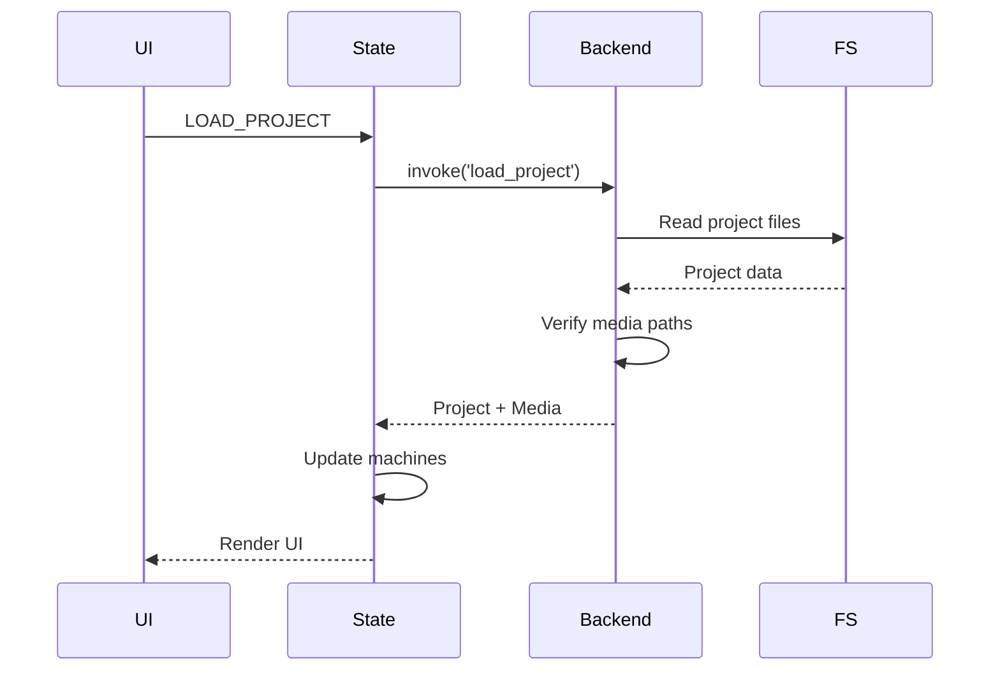

# Поток данных в Timeline Studio

[← Назад к разделу](README.md) | [← К оглавлению](../README.md)

## 📋 Содержание

- [Обзор потока данных](#обзор-потока-данных)
- [Жизненный цикл проекта](#жизненный-цикл-проекта)
- [Обработка медиафайлов](#обработка-медиафайлов)
- [Состояние таймлайна](#состояние-таймлайна)
- [Рендеринг и экспорт](#рендеринг-и-экспорт)
- [Синхронизация состояния](#синхронизация-состояния)

## 🌊 Обзор потока данных

Timeline Studio использует однонаправленный поток данных с четким разделением ответственности между слоями:

```
┌─────────────┐     ┌──────────────┐     ┌─────────────┐
│   UI Layer  │ ──> │ State Layer  │ ──> │ Data Layer  │
│   (React)   │ <── │   (XState)   │ <── │   (Rust)    │
└─────────────┘     └──────────────┘     └─────────────┘
      ▲                                           │
      └───────────── Events/Updates ──────────────┘
```

## 📂 Жизненный цикл проекта

### 1. Создание проекта

```typescript
// Frontend: Инициация создания
const createProject = async (settings: ProjectSettings) => {
  // 1. Валидация на frontend
  const validated = validateProjectSettings(settings)
  
  // 2. Отправка команды в backend
  const project = await invoke('create_project', { settings: validated })
  
  // 3. Обновление состояния
  projectMachine.send({ 
    type: 'PROJECT_CREATED', 
    project 
  })
  
  // 4. Инициализация подсистем
  await initializeTimeline(project.id)
  await initializeResources(project.id)
}
```

```rust
// Backend: Обработка создания
#[tauri::command]
async fn create_project(settings: ProjectSettings) -> Result<Project> {
    // 1. Создание структуры проекта
    let project_id = Uuid::new_v4();
    let project_dir = get_projects_dir().join(&project_id.to_string());
    fs::create_dir_all(&project_dir)?;
    
    // 2. Инициализация базы данных проекта
    let db_path = project_dir.join("project.db");
    let pool = create_project_database(&db_path).await?;
    
    // 3. Сохранение настроек
    let project = Project {
        id: project_id,
        name: settings.name,
        created_at: Utc::now(),
        settings,
        media_files: Vec::new(),
        timeline: Timeline::default(),
    };
    
    save_project_metadata(&pool, &project).await?;
    
    Ok(project)
}
```

### 2. Загрузка проекта



## 🎬 Обработка медиафайлов

### Импорт медиа

```typescript
// Frontend: Компонент импорта
export function MediaImporter() {
  const { importFiles } = useMediaImport()
  
  const handleDrop = async (files: File[]) => {
    // 1. Получение путей к файлам
    const paths = files.map(f => f.path)
    
    // 2. Запуск импорта с прогрессом
    const imported = await importFiles(paths)
    
    // 3. Обновление браузера медиа
    mediaBrowser.send({ 
      type: 'FILES_ADDED', 
      files: imported 
    })
  }
}

// Hook для импорта
function useMediaImport() {
  const importFiles = async (paths: string[]) => {
    const results = []
    
    for (const path of paths) {
      // Параллельная обработка
      results.push(
        invoke('import_media_file', { path })
      )
    }
    
    return Promise.all(results)
  }
  
  return { importFiles }
}
```

```rust
// Backend: Обработка медиа
#[tauri::command]
async fn import_media_file(
    path: String,
    state: State<'_, AppState>
) -> Result<MediaFile> {
    // 1. Проверка файла
    let metadata = extract_media_metadata(&path).await?;
    
    // 2. Генерация превью
    let thumbnail = generate_thumbnail(&path, &metadata).await?;
    
    // 3. Копирование в медиа папку проекта
    let media_path = copy_to_project_media(&path, &state.current_project).await?;
    
    // 4. Создание записи
    let media_file = MediaFile {
        id: Uuid::new_v4(),
        original_path: path,
        project_path: media_path,
        metadata,
        thumbnail,
        imported_at: Utc::now(),
    };
    
    // 5. Сохранение в БД
    save_media_file(&state.db, &media_file).await?;
    
    // 6. Обновление кэша
    state.media_cache.insert(media_file.id, media_file.clone()).await;
    
    Ok(media_file)
}
```

### Генерация превью

```rust
// Параллельная генерация превью
pub async fn generate_previews(files: Vec<MediaFile>) -> Vec<Preview> {
    use rayon::prelude::*;
    
    files
        .par_iter()
        .map(|file| {
            match file.media_type {
                MediaType::Video => generate_video_preview(file),
                MediaType::Audio => generate_waveform(file),
                MediaType::Image => generate_image_thumbnail(file),
            }
        })
        .collect()
}

async fn generate_video_preview(file: &MediaFile) -> Preview {
    // Извлечение ключевых кадров
    let keyframes = extract_keyframes(&file.path, 10).await?;
    
    // Создание спрайта превью
    let sprite = create_preview_sprite(keyframes).await?;
    
    Preview {
        file_id: file.id,
        sprite_path: sprite,
        frame_count: keyframes.len(),
    }
}
```

## 📐 Состояние таймлайна

### Структура данных таймлайна

```typescript
// types/timeline.ts
interface Timeline {
  id: string
  tracks: Track[]
  duration: number
  playhead: number
  zoom: number
  selection: Selection | null
}

interface Track {
  id: string
  type: 'video' | 'audio' | 'text'
  clips: Clip[]
  height: number
  muted: boolean
  locked: boolean
}

interface Clip {
  id: string
  mediaId: string
  trackId: string
  startTime: number
  duration: number
  inPoint: number
  outPoint: number
  effects: Effect[]
  transitions: Transition[]
}
```

### XState машина таймлайна

```typescript
// services/timeline-machine.ts
export const timelineMachine = setup({
  types: {} as {
    context: TimelineContext
    events: TimelineEvent
  },
  guards: {
    canAddClip: ({ context, event }) => {
      // Проверка на пересечения
      return !hasOverlap(context.clips, event.clip)
    },
    canSplitClip: ({ context }) => {
      return context.selectedClip !== null
    }
  },
  actions: {
    addClipToTimeline: assign({
      clips: ({ context, event }) => {
        const newClip = createClip(event.media, event.position)
        return [...context.clips, newClip]
      }
    }),
    updatePlayhead: assign({
      playhead: ({ event }) => event.position
    }),
    applyEffect: assign({
      clips: ({ context, event }) => {
        return context.clips.map(clip =>
          clip.id === event.clipId
            ? { ...clip, effects: [...clip.effects, event.effect] }
            : clip
        )
      }
    })
  }
}).createMachine({
  id: 'timeline',
  initial: 'idle',
  context: {
    clips: [],
    tracks: [],
    playhead: 0,
    zoom: 1,
    selection: null
  },
  states: {
    idle: {
      on: {
        DRAG_START: 'dragging',
        PLAY: 'playing',
        SELECT_CLIP: {
          actions: assign({
            selection: ({ event }) => ({
              type: 'clip',
              id: event.clipId
            })
          })
        }
      }
    },
    dragging: {
      on: {
        DRAG_MOVE: {
          actions: 'updateDragPosition'
        },
        DRAG_END: {
          target: 'idle',
          actions: 'finalizeDrag'
        }
      }
    },
    playing: {
      invoke: {
        src: 'playbackService',
        onSnapshot: {
          actions: 'updatePlayhead'
        }
      },
      on: {
        PAUSE: 'idle',
        STOP: {
          target: 'idle',
          actions: assign({ playhead: 0 })
        }
      }
    }
  }
})
```

### Синхронизация с видео плеером

```typescript
// hooks/useTimelineSync.ts
export function useTimelineSync() {
  const video = useVideoPlayer()
  const timeline = useTimeline()
  
  // Синхронизация позиции воспроизведения
  useEffect(() => {
    const interval = setInterval(() => {
      if (video.isPlaying) {
        timeline.send({
          type: 'UPDATE_PLAYHEAD',
          position: video.currentTime
        })
      }
    }, 16) // ~60fps
    
    return () => clearInterval(interval)
  }, [video.isPlaying])
  
  // Синхронизация seek операций
  const handleTimelineSeek = (position: number) => {
    video.seek(position)
    timeline.send({
      type: 'UPDATE_PLAYHEAD',
      position
    })
  }
  
  return { handleTimelineSeek }
}
```

## 🎨 Рендеринг и экспорт

### Процесс экспорта

```typescript
// Frontend: Инициация экспорта
async function exportVideo(settings: ExportSettings) {
  // 1. Подготовка данных таймлайна
  const timelineData = serializeTimeline(timeline)
  
  // 2. Запуск экспорта
  const exportId = await invoke('start_export', {
    timeline: timelineData,
    settings
  })
  
  // 3. Отслеживание прогресса
  const unlisten = await listen(`export-progress-${exportId}`, (event) => {
    updateProgress(event.payload)
  })
  
  // 4. Ожидание завершения
  const result = await invoke('wait_export', { exportId })
  unlisten()
  
  return result
}
```

```rust
// Backend: Процесс рендеринга
pub async fn render_timeline(
    timeline: Timeline,
    settings: ExportSettings,
    progress_tx: Sender<RenderProgress>,
) -> Result<String> {
    // 1. Создание render graph
    let graph = build_render_graph(&timeline)?;
    
    // 2. Инициализация FFmpeg
    let mut encoder = VideoEncoder::new(&settings);
    
    // 3. Рендеринг по кадрам
    let total_frames = calculate_total_frames(&timeline, &settings);
    
    for frame_num in 0..total_frames {
        // Композиция кадра
        let frame = compose_frame(&graph, frame_num).await?;
        
        // Применение эффектов
        let processed = apply_frame_effects(frame, &timeline.global_effects);
        
        // Кодирование
        encoder.encode_frame(processed)?;
        
        // Отправка прогресса
        progress_tx.send(RenderProgress {
            current: frame_num,
            total: total_frames,
            fps: encoder.current_fps(),
        }).await?;
    }
    
    // 4. Финализация
    let output_path = encoder.finalize()?;
    Ok(output_path)
}
```

### Композиция кадра

```rust
async fn compose_frame(
    graph: &RenderGraph,
    frame_num: u32
) -> Result<Frame> {
    let mut compositor = FrameCompositor::new();
    
    // Обход графа снизу вверх (по трекам)
    for track in graph.tracks.iter().rev() {
        for node in track.nodes_at_frame(frame_num) {
            match node {
                RenderNode::Clip(clip) => {
                    let frame = extract_clip_frame(clip, frame_num)?;
                    compositor.add_layer(frame, clip.blend_mode);
                }
                RenderNode::Transition(transition) => {
                    let frames = extract_transition_frames(transition, frame_num)?;
                    compositor.add_transition(frames, transition.type);
                }
                RenderNode::Text(text) => {
                    let rendered = render_text(text, frame_num)?;
                    compositor.add_overlay(rendered);
                }
            }
        }
    }
    
    Ok(compositor.finalize())
}
```

## 🔄 Синхронизация состояния

### Оптимистичные обновления

```typescript
// Оптимистичное обновление с откатом
async function updateClipEffect(clipId: string, effect: Effect) {
  // 1. Сохраняем текущее состояние
  const previousState = timeline.getSnapshot()
  
  // 2. Применяем изменение локально
  timeline.send({
    type: 'APPLY_EFFECT',
    clipId,
    effect
  })
  
  try {
    // 3. Отправляем на backend
    await invoke('update_clip_effect', { clipId, effect })
  } catch (error) {
    // 4. Откатываем при ошибке
    timeline.send({
      type: 'RESTORE_STATE',
      state: previousState
    })
    throw error
  }
}
```

### Дебаунс и батчинг

```typescript
// Батчинг обновлений позиции
const positionUpdates = useDebouncedBatch<PositionUpdate>(
  async (updates) => {
    await invoke('batch_update_positions', { updates })
  },
  100 // 100ms дебаунс
)

// Использование
function handleClipMove(clipId: string, newPosition: number) {
  // Локальное обновление
  updateClipPosition(clipId, newPosition)
  
  // Батчированное обновление на backend
  positionUpdates.add({ clipId, position: newPosition })
}
```

## 📊 Мониторинг производительности

```typescript
// Профилирование операций
class PerformanceMonitor {
  private metrics: Map<string, PerformanceMetric> = new Map()
  
  async measure<T>(name: string, operation: () => Promise<T>): Promise<T> {
    const start = performance.now()
    
    try {
      const result = await operation()
      const duration = performance.now() - start
      
      this.recordMetric(name, duration, 'success')
      return result
    } catch (error) {
      const duration = performance.now() - start
      this.recordMetric(name, duration, 'error')
      throw error
    }
  }
  
  private recordMetric(name: string, duration: number, status: string) {
    const metric = this.metrics.get(name) || {
      count: 0,
      totalDuration: 0,
      averageDuration: 0,
      maxDuration: 0
    }
    
    metric.count++
    metric.totalDuration += duration
    metric.averageDuration = metric.totalDuration / metric.count
    metric.maxDuration = Math.max(metric.maxDuration, duration)
    
    this.metrics.set(name, metric)
    
    // Отправка метрик в аналитику
    if (metric.count % 100 === 0) {
      this.sendAnalytics(name, metric)
    }
  }
}
```

---

[← Взаимодействие компонентов](communication.md) | [Далее: Функциональность →](../03-features/README.md)