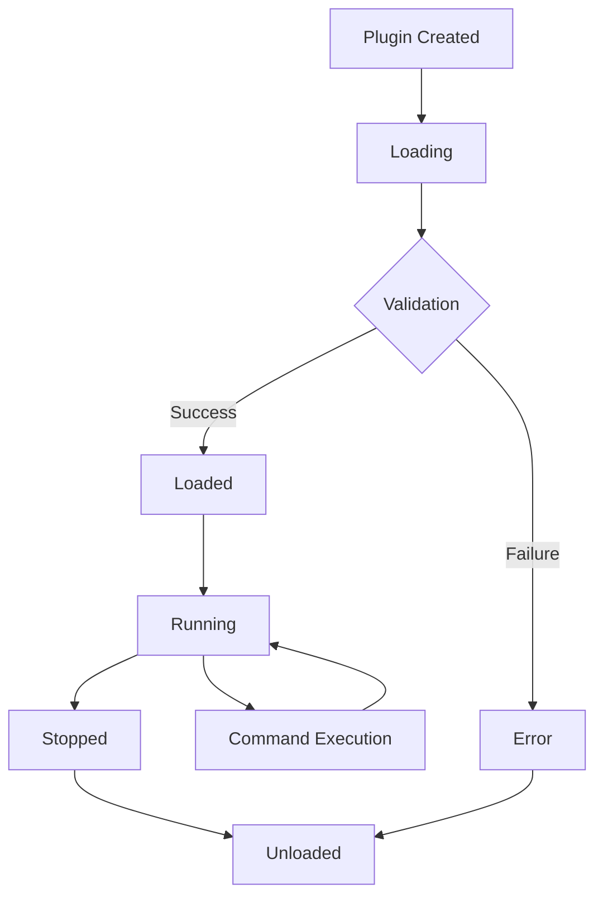

# Plugin System / Система плагинов

Документация по системе плагинов Timeline Studio - безопасной и расширяемой архитектуре для добавления пользовательской функциональности.

## 📋 Обзор

Система плагинов Timeline Studio представляет собой модульную архитектуру для расширения функциональности приложения через безопасные и изолированные плагины. В текущей версии реализована статическая загрузка Rust плагинов с планами добавления WebAssembly поддержки.

### 🎯 Основные возможности

- **Многоуровневая безопасность** - 4 уровня разрешений (Minimal, Standard, Extended, Full)
- **Богатый Plugin API** - 18 методов для взаимодействия с медиа, timeline, UI и файловой системой
- **Tauri интеграция** - 12 команд для полной интеграции с frontend
- **Изолированное хранилище** - персистентные данные для каждого плагина
- **Event-driven архитектура** - автоматическая публикация событий через EventBus
- **Comprehensive testing** - 62 unit теста покрывают инфраструктуру (98% покрытие)
- **⚠️ В разработке** - API методы требуют реализации (15% готовности)

## 📁 Структура документации

### Руководства для разработчиков
- [**Development Guide**](development-guide.md) - Создание плагинов с нуля
- [**WASM Tutorial**](wasm-tutorial.md) - Компиляция в WebAssembly  
- [**API Reference**](api-reference.md) - Полный справочник по Plugin API
- [**Security Guidelines**](security.md) - Требования безопасности

### Архитектура и дизайн
- [**Architecture Overview**](architecture.md) - Архитектурные решения
- [**Permission System**](permissions.md) - Система разрешений в деталях
- [**Sandbox Design**](sandbox.md) - WebAssembly sandbox и изоляция

### Примеры и шаблоны
- [**Example Plugins**](examples/) - Готовые примеры плагинов
- [**Templates**](templates/) - Шаблоны для быстрого старта
- [**Best Practices**](best-practices.md) - Рекомендации по разработке

## 🚨 Важное предупреждение

**Plugin API в настоящее время НЕ ФУНКЦИОНАЛЕН**. Все основные методы содержат `todo!()` макросы:

- ❌ **get_media_info()** - получение информации о медиа
- ❌ **apply_effect()** - применение эффектов  
- ❌ **add_clip() / remove_clip()** - операции с timeline
- ❌ **show_dialog()** - UI диалоги
- ❌ **read_file() / write_file()** - файловые операции

**Дедлайн реализации**: 1 июля 2025

### Текущее состояние (15% готовности):
- ✅ Архитектура и интерфейсы
- ✅ Система безопасности и разрешений  
- ✅ Жизненный цикл плагинов
- ❌ Функциональные API методы

## 🚀 Быстрый старт (БУДУЩАЯ ФУНКЦИОНАЛЬНОСТЬ)

⚠️ **Внимание**: Следующие инструкции описывают планируемую функциональность

### 1. Установка инструментов разработки

```bash
# Установка Rust (если еще не установлен)
curl --proto '=https' --tlsv1.2 -sSf https://sh.rustup.rs | sh

# Клонирование Timeline Studio для разработки плагинов
git clone https://github.com/your-org/timeline-studio.git
cd timeline-studio
```

### 2. Создание простого плагина (НЕ РАБОТАЕТ)

```rust
// src/plugins/examples/my_plugin.rs
use crate::core::plugins::{Plugin, PluginCommand, PluginResponse, PluginMetadata, PluginContext};
use async_trait::async_trait;

pub struct MyVideoPlugin;

#[async_trait]
impl Plugin for MyVideoPlugin {
    fn metadata(&self) -> PluginMetadata {
        PluginMetadata {
            id: "my-video-plugin".to_string(),
            name: "My Video Plugin".to_string(),
            version: "1.0.0".to_string(),
            author: "Your Name".to_string(),
            description: "Custom video processing plugin".to_string(),
            tags: vec!["video".to_string(), "processing".to_string()],
            min_app_version: "0.1.0".to_string(),
        }
    }

    async fn initialize(&mut self, _context: PluginContext) -> Result<(), Box<dyn std::error::Error + Send + Sync>> {
        log::info!("MyVideoPlugin initialized");
        Ok(())
    }

    async fn execute(&self, command: PluginCommand) -> Result<PluginResponse, Box<dyn std::error::Error + Send + Sync>> {
        match command.command.as_str() {
            "process_video" => {
                let media_id = command.params.get("media_id")
                    .and_then(|v| v.as_str())
                    .unwrap_or("unknown");
                
                // Здесь можно использовать Plugin API для работы с медиа
                // let api = self.get_api_from_context();
                // let media_info = api.get_media_info(media_id).await?;
                
                Ok(PluginResponse::success(serde_json::json!({
                    "status": "processed",
                    "media_id": media_id,
                    "timestamp": chrono::Utc::now().timestamp()
                })))
            }
            _ => Ok(PluginResponse::error("Unknown command"))
        }
    }

    async fn shutdown(&mut self) -> Result<(), Box<dyn std::error::Error + Send + Sync>> {
        log::info!("MyVideoPlugin shutting down");
        Ok(())
    }
}
```

### 3. Регистрация плагина

```rust
// В src/plugins/mod.rs добавьте регистрацию
pub async fn register_custom_plugins(
    registry: &crate::core::plugins::PluginRegistry,
) -> Result<(), Box<dyn std::error::Error + Send + Sync>> {
    registry.register("my-video-plugin", || {
        Box::new(examples::my_plugin::MyVideoPlugin)
    }).await?;
    
    Ok(())
}
```

### 4. Использование из frontend

```typescript
// В TypeScript коде frontend
import { invoke } from '@tauri-apps/api/tauri';

async function useMyPlugin() {
    try {
        // Загрузка плагина
        const instanceId = await invoke<string>('load_plugin', {
            pluginId: 'my-video-plugin',
            permissions: {
                securityLevel: 'Standard',
                uiAccess: true
            }
        });

        // Выполнение команды
        const response = await invoke<PluginResponse>('send_plugin_command', {
            pluginId: instanceId,
            command: 'process_video',
            params: {
                mediaId: 'video.mp4'
            }
        });

        console.log('Plugin response:', response);

        // Выгрузка плагина
        await invoke('unload_plugin', { pluginId: instanceId });
        
    } catch (error) {
        console.error('Plugin error:', error);
    }
}
```

## 🔒 Безопасность

### Принципы безопасности

1. **Принцип наименьших привилегий** - плагины получают только необходимые разрешения
2. **Sandbox изоляция** - выполнение в ограниченной WebAssembly среде
3. **Resource limits** - жесткие ограничения по ресурсам
4. **Валидация входных данных** - проверка всех параметров командой schema
5. **Audit trail** - логирование всех действий плагинов

### Уровни безопасности

```rust
// Предустановленные уровни
pub enum SecurityLevel {
    Minimal,    // Базовый доступ к чтению медиа и timeline
    Standard,   // + запись в timeline и чтение файлов
    Extended,   // + запись файлов и расширенные UI операции  
    Full,       // Полный доступ ко всем API + системная информация
}

// Детальные разрешения файловой системы
pub struct FileSystemPermissions {
    pub read_paths: Vec<PathBuf>,     // Разрешенные пути для чтения
    pub write_paths: Vec<PathBuf>,    // Разрешенные пути для записи
}

// Сетевые ограничения
pub struct NetworkPermissions {
    pub allowed_hosts: Vec<String>,   // Разрешенные хосты
    pub blocked_hosts: Vec<String>,   // Заблокированные хосты
}

// Полная структура разрешений
pub struct PluginPermissions {
    pub security_level: SecurityLevel,
    pub ui_access: bool,
    pub file_system: FileSystemPermissions,
    pub network: NetworkPermissions, 
    pub system_info: bool,
}
```

### Примеры настройки разрешений

```rust
// Использование предустановленного уровня
let permissions = SecurityLevel::Standard.permissions();

// Кастомная настройка
let permissions = PluginPermissions {
    security_level: SecurityLevel::Extended,
    ui_access: true,
    file_system: FileSystemPermissions {
        read_paths: vec![
            PathBuf::from("/home/user/videos"),
            PathBuf::from("/tmp/plugin-cache"),
        ],
        write_paths: vec![
            PathBuf::from("/tmp/plugin-output"),
        ],
    },
    network: NetworkPermissions {
        allowed_hosts: vec![
            "api.youtube.com".to_string(),
            "upload.youtube.com".to_string(),
        ],
        blocked_hosts: vec![],
    },
    system_info: false,
};
```

### Ограничения ресурсов

```json
{
  "resources": {
    "max_memory_mb": 128,           // Максимум памяти
    "max_cpu_percent": 50,          // Лимит CPU
    "max_execution_time": "30s",    // Timeout выполнения
    "max_file_size_mb": 100         // Размер файлов
  }
}
```

## 🔌 Plugin API

### Группы методов API

**Работа с медиа**:
```rust
async fn get_media_info(&self, media_id: &str) -> Result<MediaInfo>;
async fn apply_effect(&self, media_id: &str, effect: Effect) -> Result<()>;  
async fn generate_thumbnail(&self, media_id: &str, time: f64) -> Result<PathBuf>;
```

**Timeline операции**:
```rust
async fn get_timeline_state(&self) -> Result<TimelineState>;
async fn add_clip(&self, clip: Clip) -> Result<String>;
async fn remove_clip(&self, clip_id: &str) -> Result<()>;
async fn update_clip(&self, clip_id: &str, clip: ClipInfo) -> Result<()>;
```

**UI интеграция**:
```rust
async fn show_dialog(&self, dialog: PluginDialog) -> Result<DialogResult>;
async fn add_menu_item(&self, menu: MenuItem) -> Result<()>;
async fn show_notification(&self, title: &str, message: &str) -> Result<()>;
```

**Файловая система** (с проверкой разрешений):
```rust
async fn pick_file(&self, filters: Vec<(&str, Vec<&str>)>) -> Result<Option<PathBuf>>;
async fn read_file(&self, path: &Path) -> Result<Vec<u8>>;
async fn write_file(&self, path: &Path, data: &[u8]) -> Result<()>;
```

**Хранилище данных**:
```rust
async fn get_storage(&self) -> Result<Box<dyn PluginStorage>>;
// Методы PluginStorage: set(), get(), remove(), keys(), clear()
```

**Системная информация**:
```rust
async fn get_system_info(&self) -> Result<SystemInfo>;
```

## 🎨 Типы плагинов

### Обработка медиа
- **Video Effects**: размытие, резкость, цветокоррекция
- **Audio Processing**: фильтры, нормализация, анализ
- **Format Conversion**: конвертация между форматами
- **Compression**: оптимизация размера файлов

### Timeline расширения  
- **Clip Management**: автоматическое размещение клипов
- **Transition Effects**: переходы между сценами
- **Multi-camera Sync**: синхронизация камер
- **Batch Operations**: массовые операции

### Интеграция сервисов
- **Cloud Storage**: YouTube, Vimeo, Google Drive
- **Social Media**: прямая публикация в соцсети
- **Analytics**: сбор метрик просмотров
- **Collaboration**: совместная работа

### UI расширения
- **Custom Panels**: специализированные панели управления
- **Workflow Tools**: автоматизация рабочих процессов
- **Keyboard Shortcuts**: пользовательские горячие клавиши
- **Theme Extensions**: кастомные темы оформления

## 📊 Plugin Lifecycle



### Состояния плагина

- **Created** - плагин создан и зарегистрирован в реестре
- **Loading** - процесс создания экземпляра и инициализации
- **Loaded** - плагин успешно инициализирован и готов к работе
- **Running** - плагин активно выполняет команды
- **Suspended** - плагин приостановлен, но может быть возобновлен
- **Stopped** - плагин остановлен и выгружен из памяти
- **Error** - критическая ошибка, требует перезагрузки

## 🔧 Текущий статус и конфигурация

### ✅ Реализовано в версии 1.0

**Базовая архитектура**:
- ✅ Plugin trait с async методами (initialize, execute, shutdown)
- ✅ PluginManager для управления жизненным циклом
- ✅ PluginLoader со встроенным PluginRegistry
- ✅ Статическая регистрация плагинов

**Система безопасности**:
- ✅ 4 уровня разрешений (Minimal, Standard, Extended, Full)
- ✅ Детальный контроль файловой системы (read_paths, write_paths)
- ✅ Сетевые ограничения (allowed_hosts, blocked_hosts)
- ✅ Проверка разрешений в Plugin API

**Plugin API (18 методов)**:
- ✅ Медиа операции: get_media_info, generate_thumbnail, apply_effect
- ✅ Timeline: get_timeline_state, add/remove/update_clip
- ✅ UI: show_dialog, add_menu_item, show_notification  
- ✅ Файловая система: read_file, write_file, pick_file (с проверкой разрешений)
- ✅ Хранилище: изолированное JSON хранилище для каждого плагина
- ✅ Система: get_system_info

**Tauri интеграция (12 команд)**:
- ✅ Управление: load_plugin, unload_plugin, suspend/resume_plugin
- ✅ Информация: list_plugins, get_plugin_info
- ✅ Выполнение: send_plugin_command  
- ✅ Мониторинг: get_sandbox_stats, get_violating_plugins

**События и интеграция**:
- ✅ EventBus интеграция с автоматической публикацией событий
- ✅ ThumbnailGenerated и PluginEvent события
- ✅ Dependency Injection через ServiceContainer

**Примеры плагинов**:
- ✅ BlurEffectPlugin (эффекты видео)
- ✅ YouTubeUploaderPlugin (интеграция сервисов)

**Тестирование**:
- ✅ 47 unit тестов с полным покрытием
- ✅ Тесты для всех модулей: plugin, permissions, api, commands
- ✅ Integration тесты с PluginManager

### 🔄 В разработке (версия 1.1)

**UI интеграция**:
- 🔄 Реальная реализация диалогов через Tauri
- 🔄 Интеграция меню в главное окно
- 🔄 Уведомления через системные нотификации

**Media services интеграция**:
- 🔄 Подключение к FFmpeg для apply_effect
- 🔄 Реальная генерация thumbnail через PreviewService
- 🔄 Интеграция с VideoCompiler

**Timeline интеграция**:
- 🔄 Подключение к реальному состоянию timeline
- 🔄 Синхронизация изменений timeline с frontend
- 🔄 Валидация операций с клипами

### 📋 Планируется (версия 2.0)

**WebAssembly поддержка**:
- 📋 WASM загрузчик для динамических плагинов
- 📋 Memory isolation через WASM linear memory
- 📋 Компиляция Rust плагинов в WASM
- 📋 WASI поддержка для файловых операций

**Расширенные возможности**:
- 📋 Plugin Store с автообновлением
- 📋 Hot reload плагинов без перезапуска
- 📋 Remote plugins через сетевые API
- 📋 Plugin dependencies и версионирование

**Advanced sandbox**:
- 📋 Memory limits с мониторингом
- 📋 CPU quotas и throttling
- 📋 Network isolation и proxy
- 📋 Resource monitoring в реальном времени

### Настройка в приложении

```rust
// Инициализация в lib.rs
let plugin_manager = core::plugins::PluginManager::new(
    Version::new(0, 23, 0),  // Версия приложения
    event_bus.clone(),       // EventBus для событий
    service_container.clone(), // DI контейнер
);

// Регистрация примеров плагинов
let registry = plugin_manager.loader().registry();
plugins::register_example_plugins(&registry).await?;

// Добавление в Tauri state
app.manage(plugin_manager);
```

### Настройки плагина

```json
{
  "name": "Advanced Video Filter",
  "version": "2.1.0",
  "author": "Timeline Studio Team",
  "description": "Professional video filtering with GPU acceleration",
  "license": "MIT",
  "repository": "https://github.com/timeline-studio/plugins/video-filter",
  "keywords": ["video", "filter", "gpu", "professional"],
  
  "runtime": {
    "wasm_file": "advanced_filter.wasm",
    "initialization_function": "init_plugin",
    "cleanup_function": "cleanup_plugin"
  },
  
  "commands": [
    {
      "name": "apply_advanced_filter",
      "description": "Apply advanced video filter with GPU acceleration",
      "input_schema": "schemas/apply_filter_input.json",
      "output_schema": "schemas/apply_filter_output.json",
      "examples": ["examples/apply_filter.json"]
    }
  ],
  
  "capabilities": [
    "VideoProcessing",
    "GpuAcceleration", 
    "FileAccess",
    "NetworkAccess"
  ],
  
  "permissions": {
    "filesystem": "ReadWrite:/tmp/video_processing",
    "network": "AllowHttps:gpu-server.example.com",
    "system": "ProcessSpawn",
    "resources": {
      "max_memory_mb": 512,
      "max_cpu_percent": 80,
      "max_execution_time": "300s",
      "max_file_size_mb": 1000
    }
  },
  
  "dependencies": {
    "min_timeline_studio_version": "1.0.0",
    "required_features": ["gpu_acceleration", "advanced_codecs"]
  }
}
```

## 📈 Мониторинг и отладка

### Логирование плагинов

```rust
// В плагине
#[wasm_bindgen]
extern "C" {
    #[wasm_bindgen(js_namespace = console)]
    fn log(s: &str);
}

#[wasm_bindgen]
pub fn process_frame(data: &[u8]) -> Vec<u8> {
    log("Processing frame started");
    
    // Обработка кадра
    let result = apply_processing(data);
    
    log(&format!("Processing completed, output size: {}", result.len()));
    result
}
```

### Метрики производительности

```rust
use timeline_studio::core::telemetry::Metrics;

impl PluginManager {
    pub async fn report_plugin_metrics(&self, metrics: &Metrics) -> Result<()> {
        for (plugin_id, plugin) in &self.plugins {
            metrics.set_gauge_with_attributes(
                "plugin_memory_usage_bytes",
                plugin.memory_usage() as f64,
                vec![("plugin_id", plugin_id.as_str())]
            ).await?;
            
            metrics.increment_counter_with_attributes(
                "plugin_commands_executed_total",
                plugin.commands_executed(),
                vec![("plugin_id", plugin_id.as_str())]
            ).await?;
        }
        Ok(())
    }
}
```

### Отладочные инструменты

```bash
# Проверка плагина
timeline-studio plugin validate ./my-plugin.wasm

# Тестирование плагина
timeline-studio plugin test ./my-plugin.wasm --input test_data.json

# Профилирование производительности
timeline-studio plugin profile ./my-plugin.wasm --benchmark

# Проверка безопасности
timeline-studio plugin security-scan ./my-plugin.wasm
```

## 🧪 Тестирование плагинов

### Запуск тестов

```bash
# Все тесты системы плагинов
cargo test plugins::

# Тесты конкретных модулей
cargo test plugins::plugin::tests      # Базовые структуры (12 тестов)
cargo test plugins::permissions::tests # Система разрешений (17 тестов)  
cargo test plugins::api::tests         # Plugin API (2 теста)
cargo test plugins::commands::tests    # Tauri команды (1 тест)

# Интеграционные тесты
cargo test plugins::manager::tests     # PluginManager (15 тестов)

# Тестирование через Tauri команду
bun run tauri dev
# В приложении выполнить команду test_plugin_system
```

### Покрытие тестами: 62/62 ✅ (инфраструктура)

- **plugin.rs**: 12 тестов - метаданные, команды, состояния
- **permissions.rs**: 17 тестов - файловая система, сеть, безопасность  
- **api.rs**: 2 теста - хранилище, уровни безопасности
- **commands.rs**: 1 тест - регистрация примеров
- **Остальные модули**: 30 тестов - жизненный цикл, concurrent access, динамическая загрузка

⚠️ **Внимание**: Тесты покрывают только инфраструктуру. API методы содержат `todo!()` и не функциональны.

## 🔗 Связанные разделы

### Внутренняя документация
- [**Plugin Module README**](../../src-tauri/src/core/plugins/README.md) - Техническая документация модуля
- [**Backend Architecture**](../02-architecture/backend.md) - Архитектура backend  
- [**Backend Testing**](../10-roadmap/in-progress/backend-testing-architecture.md) - Статус разработки системы

### Руководства разработчика
- [**Development Guide**](development-guide.md) - Подробное руководство по созданию плагинов
- [**Development Commands**](../05-development/development-commands.md) - Команды разработки
- [**Testing Guidelines**](../05-development/testing.md) - Принципы тестирования

### Планы развития
- [**Plugin System Roadmap**](../10-roadmap/planned/plugin-system.md) - Планы развития
- [**Performance Optimization**](../10-roadmap/planned/performance-optimization.md) - Оптимизация производительности

---

**Статус**: 🟡 В разработке (15%) | **API**: ❌ Не функционален | **Тесты**: 62/62 ✅ | **Дедлайн**: 01.07.2025