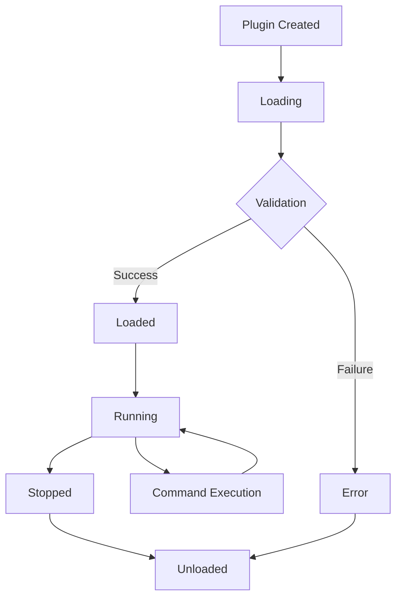

# Plugin System / Система плагинов

Документация по системе плагинов Timeline Studio - безопасной и расширяемой архитектуре для добавления пользовательской функциональности.

## 📋 Обзор

Система плагинов Timeline Studio позволяет разработчикам создавать расширения для добавления новых возможностей обработки видео, фильтров, эффектов и интеграций с внешними сервисами. Плагины выполняются в изолированной WebAssembly среде для обеспечения безопасности.

### 🎯 Основные возможности

- **WebAssembly изоляция** - плагины выполняются в безопасной sandbox среде
- **Granular permissions** - точный контроль доступа к файловой системе, сети и системным ресурсам
- **Resource limits** - ограничения по памяти, CPU и времени выполнения
- **Hot-swappable** - загрузка и выгрузка плагинов без перезапуска приложения
- **Type-safe API** - строго типизированные интерфейсы для взаимодействия
- **Comprehensive testing** - 29 unit тестов с полным покрытием функциональности

## 📁 Структура документации

### Руководства для разработчиков
- [**Development Guide**](development-guide.md) - Создание плагинов с нуля
- [**WASM Tutorial**](wasm-tutorial.md) - Компиляция в WebAssembly  
- [**API Reference**](api-reference.md) - Полный справочник по Plugin API
- [**Security Guidelines**](security.md) - Требования безопасности

### Архитектура и дизайн
- [**Architecture Overview**](architecture.md) - Архитектурные решения
- [**Permission System**](permissions.md) - Система разрешений в деталях
- [**Sandbox Design**](sandbox.md) - WebAssembly sandbox и изоляция

### Примеры и шаблоны
- [**Example Plugins**](examples/) - Готовые примеры плагинов
- [**Templates**](templates/) - Шаблоны для быстрого старта
- [**Best Practices**](best-practices.md) - Рекомендации по разработке

## 🚀 Быстрый старт

### 1. Установка инструментов разработки

```bash
# Установка Rust и wasm-pack
curl --proto '=https' --tlsv1.2 -sSf https://sh.rustup.rs | sh
cargo install wasm-pack

# Добавление WebAssembly target
rustup target add wasm32-unknown-unknown
```

### 2. Создание простого плагина

```rust
// src/lib.rs
use wasm_bindgen::prelude::*;

#[wasm_bindgen]
pub struct VideoFilter;

#[wasm_bindgen]
impl VideoFilter {
    #[wasm_bindgen(constructor)]
    pub fn new() -> VideoFilter {
        VideoFilter
    }
    
    #[wasm_bindgen]
    pub fn apply_blur(&self, intensity: f32) -> String {
        // Логика применения размытия
        format!("Applied blur with intensity: {}", intensity)
    }
}

// Экспорт метаданных плагина
#[wasm_bindgen]
pub fn get_plugin_metadata() -> String {
    serde_json::json!({
        "name": "Video Blur Filter",
        "version": "1.0.0",
        "author": "Your Name",
        "description": "Applies blur effect to video frames",
        "commands": [
            {
                "name": "apply_blur",
                "description": "Apply blur filter",
                "input_schema": {
                    "type": "object",
                    "properties": {
                        "intensity": {"type": "number", "minimum": 0, "maximum": 10}
                    },
                    "required": ["intensity"]
                },
                "output_schema": {
                    "type": "string"
                }
            }
        ],
        "capabilities": ["VideoProcessing"],
        "permissions": {
            "filesystem": "ReadOnly:/tmp/video_cache",
            "network": "NoAccess",
            "system": "TimeAccess"
        }
    }).to_string()
}
```

### 3. Компиляция плагина

```bash
# Создание проекта
cargo new --lib video-blur-plugin
cd video-blur-plugin

# Добавление зависимостей в Cargo.toml
[dependencies]
wasm-bindgen = "0.2"
serde_json = "1.0"

[lib]
crate-type = ["cdylib"]

# Компиляция в WebAssembly
wasm-pack build --target web --out-dir pkg
```

### 4. Загрузка в Timeline Studio

```rust
use timeline_studio::core::plugins::*;

#[tokio::main]
async fn main() -> Result<()> {
    let mut plugin_manager = PluginManager::new();
    
    // Загрузка плагина
    let plugin_id = plugin_manager.load_plugin("./video-blur-plugin/pkg/video_blur_plugin.wasm").await?;
    
    // Выполнение команды
    let result = plugin_manager.execute_command(
        &plugin_id,
        "apply_blur",
        serde_json::json!({"intensity": 5.0})
    ).await?;
    
    println!("Plugin result: {}", result);
    Ok(())
}
```

## 🔒 Безопасность

### Принципы безопасности

1. **Принцип наименьших привилегий** - плагины получают только необходимые разрешения
2. **Sandbox изоляция** - выполнение в ограниченной WebAssembly среде
3. **Resource limits** - жесткие ограничения по ресурсам
4. **Валидация входных данных** - проверка всех параметров командой schema
5. **Audit trail** - логирование всех действий плагинов

### Типы разрешений

```rust
// Файловая система
"ReadOnly:/path/to/allowed/directory"     // Только чтение
"WriteOnly:/path/to/output"               // Только запись
"ReadWrite:/path/to/workspace"            // Полный доступ
"TempAccess"                              // Временные файлы
"NoAccess"                                // Запрет доступа

// Сеть
"AllowHttp:example.com,api.service.com"   // HTTP к указанным доменам
"AllowHttps:secure-api.com"               // HTTPS подключения
"AllowLocalhost"                          // Локальные подключения
"NoAccess"                                // Запрет сети

// Система
"ProcessSpawn"                            // Запуск процессов
"EnvironmentRead"                         // Переменные окружения
"TimeAccess"                              // Системное время
"NoAccess"                                // Запрет системных вызовов
```

### Ограничения ресурсов

```json
{
  "resources": {
    "max_memory_mb": 128,           // Максимум памяти
    "max_cpu_percent": 50,          // Лимит CPU
    "max_execution_time": "30s",    // Timeout выполнения
    "max_file_size_mb": 100         // Размер файлов
  }
}
```

## 🎨 Типы плагинов

### Video Processing Plugins
- Frame filters и effects
- Color correction
- Noise reduction
- Motion detection
- Object tracking

### Audio Processing Plugins  
- Audio filters
- Noise reduction
- EQ и dynamics
- Audio analysis
- Speech recognition

### Import/Export Plugins
- Custom file formats
- Cloud storage integration
- External API connections
- Database connectors
- Streaming protocols

### UI Extension Plugins
- Custom controls
- Dashboard widgets
- Timeline extensions
- Property panels
- Tool palettes

## 📊 Plugin Lifecycle



### Состояния плагина

- **Created** - плагин создан, но не загружен
- **Loading** - процесс загрузки WASM модуля
- **Loaded** - плагин загружен и готов к работе
- **Running** - плагин выполняет команды
- **Stopped** - плагин остановлен, но может быть перезапущен
- **Error** - критическая ошибка, требует перезагрузки

## 🔧 Конфигурация

### Глобальные настройки плагинов

```json
{
  "plugin_system": {
    "enabled": true,
    "plugin_directory": "./plugins",
    "max_concurrent_plugins": 10,
    "default_timeout": "30s",
    "sandbox_config": {
      "max_memory_pages": 256,
      "max_execution_steps": 1000000,
      "max_call_depth": 1000,
      "allowed_imports": [
        "log",
        "read_file", 
        "write_file",
        "http_get"
      ]
    },
    "default_permissions": {
      "filesystem": "TempAccess",
      "network": "NoAccess", 
      "system": "TimeAccess",
      "resources": {
        "max_memory_mb": 64,
        "max_cpu_percent": 25,
        "max_execution_time": "10s",
        "max_file_size_mb": 50
      }
    }
  }
}
```

### Настройки плагина

```json
{
  "name": "Advanced Video Filter",
  "version": "2.1.0",
  "author": "Timeline Studio Team",
  "description": "Professional video filtering with GPU acceleration",
  "license": "MIT",
  "repository": "https://github.com/timeline-studio/plugins/video-filter",
  "keywords": ["video", "filter", "gpu", "professional"],
  
  "runtime": {
    "wasm_file": "advanced_filter.wasm",
    "initialization_function": "init_plugin",
    "cleanup_function": "cleanup_plugin"
  },
  
  "commands": [
    {
      "name": "apply_advanced_filter",
      "description": "Apply advanced video filter with GPU acceleration",
      "input_schema": "schemas/apply_filter_input.json",
      "output_schema": "schemas/apply_filter_output.json",
      "examples": ["examples/apply_filter.json"]
    }
  ],
  
  "capabilities": [
    "VideoProcessing",
    "GpuAcceleration", 
    "FileAccess",
    "NetworkAccess"
  ],
  
  "permissions": {
    "filesystem": "ReadWrite:/tmp/video_processing",
    "network": "AllowHttps:gpu-server.example.com",
    "system": "ProcessSpawn",
    "resources": {
      "max_memory_mb": 512,
      "max_cpu_percent": 80,
      "max_execution_time": "300s",
      "max_file_size_mb": 1000
    }
  },
  
  "dependencies": {
    "min_timeline_studio_version": "1.0.0",
    "required_features": ["gpu_acceleration", "advanced_codecs"]
  }
}
```

## 📈 Мониторинг и отладка

### Логирование плагинов

```rust
// В плагине
#[wasm_bindgen]
extern "C" {
    #[wasm_bindgen(js_namespace = console)]
    fn log(s: &str);
}

#[wasm_bindgen]
pub fn process_frame(data: &[u8]) -> Vec<u8> {
    log("Processing frame started");
    
    // Обработка кадра
    let result = apply_processing(data);
    
    log(&format!("Processing completed, output size: {}", result.len()));
    result
}
```

### Метрики производительности

```rust
use timeline_studio::core::telemetry::Metrics;

impl PluginManager {
    pub async fn report_plugin_metrics(&self, metrics: &Metrics) -> Result<()> {
        for (plugin_id, plugin) in &self.plugins {
            metrics.set_gauge_with_attributes(
                "plugin_memory_usage_bytes",
                plugin.memory_usage() as f64,
                vec![("plugin_id", plugin_id.as_str())]
            ).await?;
            
            metrics.increment_counter_with_attributes(
                "plugin_commands_executed_total",
                plugin.commands_executed(),
                vec![("plugin_id", plugin_id.as_str())]
            ).await?;
        }
        Ok(())
    }
}
```

### Отладочные инструменты

```bash
# Проверка плагина
timeline-studio plugin validate ./my-plugin.wasm

# Тестирование плагина
timeline-studio plugin test ./my-plugin.wasm --input test_data.json

# Профилирование производительности
timeline-studio plugin profile ./my-plugin.wasm --benchmark

# Проверка безопасности
timeline-studio plugin security-scan ./my-plugin.wasm
```

## 🔗 Связанные разделы

- [**Backend Architecture**](../02-architecture/backend.md) - Архитектура backend
- [**Development Commands**](../05-development/development-commands.md) - Команды разработки
- [**Performance Optimization**](../08-roadmap/planned/performance-optimization.md) - Оптимизация производительности
- [**Backend Testing**](../08-roadmap/in-progress/backend-testing-architecture.md) - Тестирование backend

---

*Последнее обновление: 24 июня 2025*