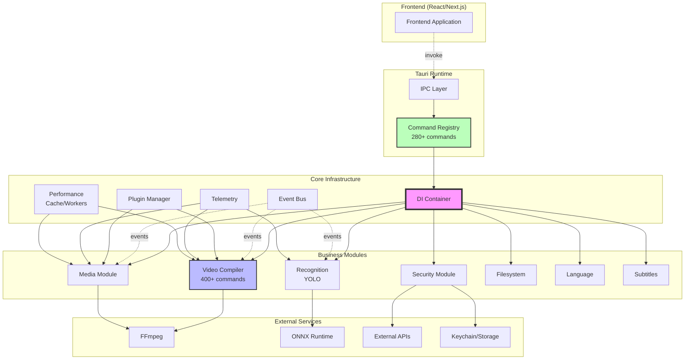

# Backend Architecture Diagram

## Module Interactions



## Data Flow

### 1. Command Processing
```
Frontend → Tauri IPC → Command Registry → DI Container → Module → Service
```

### 2. Event Processing
```
Service → Event Bus → Subscribers → Frontend (via Tauri events)
```

### 3. Media Processing
```
Media Module → FFmpeg → Processing → Cache → Result → Frontend
```

### 4. Video Rendering
```
Video Compiler → Pipeline Stages → FFmpeg Builder → FFmpeg Executor → Progress Events
```

## Key Components

### Core Infrastructure
- **DI Container**: Dependency management and service lifecycle
- **Event Bus**: Asynchronous communication between components
- **Plugin Manager**: WASM-based plugin system with sandbox isolation
- **Telemetry**: OpenTelemetry metrics, tracing and health checks
- **Performance**: Caching (LRU/LFU/FIFO), worker pools, zero-copy

### Video Compiler
- **Pipeline Architecture**: Step-by-step video processing
- **GPU Acceleration**: NVENC, QuickSync, VideoToolbox, AMF
- **Cache System**: LRU cache for previews and metadata
- **FFmpeg Integration**: Builder pattern for command construction

### Security Module
- **Secure Storage**: AES-GCM encryption for API keys
- **System Integration**: Keychain (macOS), Credential Manager (Windows)
- **OAuth Support**: YouTube, Instagram, TikTok
- **API Validation**: OpenAI, Anthropic, Google key verification

### Media Module
- **Parallel Processing**: Up to 4 files simultaneously
- **Metadata Cache**: Caching with TTL
- **Preview Generation**: Asynchronous thumbnail generation
- **Format Support**: MP4, MOV, AVI, MKV, MP3, WAV, JPG, PNG and more

### Recognition Module
- **YOLO Integration**: ONNX Runtime for model execution
- **Batch Processing**: Video processing in batches
- **Result Aggregation**: Aggregation of results by time and classes

## Design Principles

1. **Modularity**: Each module is self-contained
2. **Asynchrony**: All I/O operations are non-blocking
3. **Safety**: Type-safe code without unsafe blocks
4. **Performance**: Caching, GPU acceleration, parallelism
5. **Observability**: Metrics, logs, tracing, health checks

## Scaling

### Horizontal
- Worker pools for parallel processing
- Independent services through DI
- Event-driven architecture

### Vertical
- GPU acceleration for video
- Zero-copy operations
- Memory pooling for frequent allocations

## Extension Points

1. **New modules**: Registration through DI container
2. **New commands**: Adding to app_builder.rs
3. **New plugins**: WASM plugins through Plugin Manager
4. **New formats**: Extension through FFmpeg
5. **New services**: Integration through Service Container