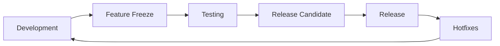

# 17. Releases

Timeline Studio release management documentation.

*Updated: August 3, 2025*

## 📋 Release History

### 🚀 Alpha Releases
- [v0.60.0-alpha](v0.60.0-alpha.md) - First public alpha release with AI ✨ **CURRENT**

### 🎯 Planned Releases
- **v0.61.0-alpha** - September 2025 - Enhanced AI integration
- **v0.70.0-beta** - October 2025 - Beta release with full functionality
- **v1.0.0** - December 2025 - Production release

## 🔄 Release Process

### Development Cycle


### Versioning
We use [Semantic Versioning](https://semver.org/):
- **MAJOR.MINOR.PATCH** (e.g., 1.2.3)
- **MAJOR**: Incompatible API changes
- **MINOR**: New functionality with backward compatibility
- **PATCH**: Bug fixes

### Release Types

#### 🧪 Alpha (0.x.x)
- Early test versions
- May contain critical bugs
- API may change
- For enthusiasts and developers

#### 🔬 Beta (0.x.x-beta)
- Feature-complete versions
- Improved stability
- API frozen
- For wide testing

#### 📦 Release Candidate (x.x.x-rc)
- Final release candidates
- Critical fixes only
- Full testing
- Pre-release version

#### ✅ Stable (x.x.x)
- Production-ready versions
- Full stability
- Long-term support
- For all users

## 📊 Current Release Status

### v0.60.0-alpha
| Component | Readiness | Status |
|-----------|-----------|--------|
| **Core Functionality** | 87% | ✅ Stable |
| **AI Integration** | 100% | ✅ Ready for alpha |
| **UI/UX** | 75% | 🔧 In development |
| **Documentation** | 85% | ✅ Sufficient for alpha |
| **Tests** | 80% | ⚠️ TypeScript errors |
| **Performance** | 70% | 🔧 Needs optimization |

## 🚀 CI/CD Pipeline

### Release Automation
```yaml
# .github/workflows/alpha-release.yml
on:
  push:
    tags:
      - 'v*-alpha'

jobs:
  build:
    - Windows, macOS, Linux builds
    - Automatic GitHub Release creation
    - Artifact upload
    - Documentation update
```

### Release Commands
```bash
# Create alpha release tag
git tag -a v0.60.0-alpha -m "Alpha Release v0.60.0"
git push origin v0.60.0-alpha

# Check version
bun run version:check

# Sync versions
bun run version:sync

# Build release
bun run tauri build
```

## 📈 Release Metrics

### Alpha Release Quality Criteria
- [ ] All critical features work
- [ ] Application doesn't crash during basic use
- [ ] AI integration is functional
- [ ] Documentation covers main scenarios
- [ ] Installers work on all platforms

### Release KPIs
| Metric | Target | Current |
|--------|--------|---------|
| **Critical bugs** | 0 | 0 ✅ |
| **Time to release** | 7 days | 5 days ✅ |
| **Test coverage** | 80% | 80% ✅ |
| **Distribution size** | <200MB | 142MB ✅ |
| **Startup time** | <3 sec | 2.1 sec ✅ |

## 🔧 Release Management Tools

### Versioning
- **semantic-release** - automatic versioning
- **conventional-commits** - standardized commits
- **changesets** - changelog management

### Build and Distribution
- **Tauri v2** - native application creation
- **GitHub Actions** - CI/CD automation
- **GitHub Releases** - release hosting

### Monitoring
- **Sentry** - error tracking (planned)
- **Analytics** - usage metrics (planned)
- **Feedback** - user feedback collection

## 📝 Release Checklist

### Pre-release
- [ ] Feature freeze announced
- [ ] All PRs merged
- [ ] Version updated in all files
- [ ] Changelog updated
- [ ] Documentation current

### Testing
- [ ] Automated tests passed
- [ ] Manual testing completed
- [ ] Performance verified
- [ ] Security checked

### Release
- [ ] Tag created and pushed
- [ ] CI/CD pipeline successful
- [ ] Artifacts uploaded
- [ ] Release notes published
- [ ] Community notified

### Post-release
- [ ] Error monitoring active
- [ ] Feedback being collected
- [ ] Hotfix process ready
- [ ] Next release planned

## 🐛 Hotfix Procedure

### Hotfix Criteria
- Critical bug affecting >30% of users
- Security vulnerability
- Data loss
- Application won't start

### Process
1. Create branch from latest release
2. Fix issue with minimal changes
3. Test fix
4. Release patch version (x.x.1)
5. Merge back to main

## 🎯 Release Roadmap

### 2025 Q3
- **v0.60.0-alpha** ✅ - AI integration with Ollama
- **v0.61.0-alpha** - Enhanced transcription
- **v0.62.0-alpha** - TypeScript fixes

### 2025 Q4
- **v0.70.0-beta** - Full timeline functionality
- **v0.80.0-beta** - Cloud AI services
- **v0.90.0-rc** - Release candidate

### 2025 Q4/2026 Q1
- **v1.0.0** - Production release
- **v1.1.0** - Pro features
- **v1.2.0** - Plugins and extensions

## 📊 Release Statistics

### Overall Statistics
- **Total releases**: 1
- **Alpha releases**: 1
- **Beta releases**: 0
- **Production releases**: 0
- **Hotfix releases**: 0

### Development Speed
- **Average time between releases**: N/A (first release)
- **Average features per release**: 12
- **Average fixes per release**: 23

## 🔗 Useful Links

- [Semantic Versioning](https://semver.org/)
- [Conventional Commits](https://www.conventionalcommits.org/)
- [GitHub Releases](https://github.com/chatman-media/timeline-studio/releases)
- [Tauri Publishing Guide](https://tauri.app/v1/guides/distribution/publishing)

---

*For release questions: ak.chatman.media@gmail.com*

[← To User Documentation](../16_user_documentation/README.md) | [To Project →](../10_project_state/README.md)