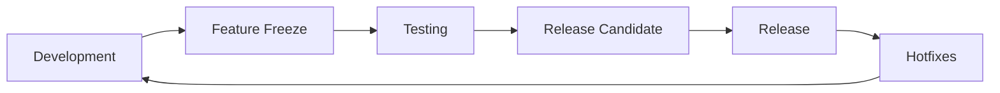

# 17. Релизы

Документация по управлению релизами Timeline Studio.

*Обновлено: 3 августа 2025*

## 📋 История релизов

### 🚀 Альфа релизы
- [v0.60.0-alpha](v0.60.0-alpha.md) - Первый публичный альфа-релиз с AI ✨ **CURRENT**

### 🎯 Планируемые релизы
- **v0.61.0-alpha** - Сентябрь 2025 - Улучшенная AI интеграция
- **v0.70.0-beta** - Октябрь 2025 - Beta релиз с полным функционалом
- **v1.0.0** - Декабрь 2025 - Production релиз

## 🔄 Процесс релизов

### Цикл разработки


### Версионирование
Используем [Semantic Versioning](https://semver.org/):
- **MAJOR.MINOR.PATCH** (например, 1.2.3)
- **MAJOR**: Несовместимые изменения API
- **MINOR**: Новый функционал с обратной совместимостью
- **PATCH**: Исправления багов

### Типы релизов

#### 🧪 Alpha (0.x.x)
- Ранние тестовые версии
- Может содержать критические баги
- API может меняться
- Для энтузиастов и разработчиков

#### 🔬 Beta (0.x.x-beta)
- Функционально полные версии
- Стабильность улучшена
- API заморожен
- Для широкого тестирования

#### 📦 Release Candidate (x.x.x-rc)
- Кандидаты на финальный релиз
- Только критические исправления
- Полное тестирование
- Предрелизная версия

#### ✅ Stable (x.x.x)
- Production-ready версии
- Полная стабильность
- Долгосрочная поддержка
- Для всех пользователей

## 📊 Статус текущего релиза

### v0.60.0-alpha
| Компонент | Готовность | Статус |
|-----------|------------|--------|
| **Core функционал** | 87% | ✅ Стабилен |
| **AI интеграция** | 100% | ✅ Готов для альфы |
| **UI/UX** | 75% | 🔧 В разработке |
| **Документация** | 85% | ✅ Достаточно для альфы |
| **Тесты** | 80% | ⚠️ TypeScript ошибки |
| **Производительность** | 70% | 🔧 Требует оптимизации |

## 🚀 CI/CD Pipeline

### Автоматизация релизов
```yaml
# .github/workflows/alpha-release.yml
on:
  push:
    tags:
      - 'v*-alpha'

jobs:
  build:
    - Windows, macOS, Linux builds
    - Автоматическое создание GitHub Release
    - Загрузка артефактов
    - Обновление документации
```

### Команды для релиза
```bash
# Создание тега для альфа-релиза
git tag -a v0.60.0-alpha -m "Alpha Release v0.60.0"
git push origin v0.60.0-alpha

# Проверка версии
bun run version:check

# Синхронизация версий
bun run version:sync

# Сборка релиза
bun run tauri build
```

## 📈 Метрики релизов

### Критерии качества альфа-релиза
- [ ] Все критические функции работают
- [ ] Приложение не крашится при базовом использовании
- [ ] AI интеграция функциональна
- [ ] Документация покрывает основные сценарии
- [ ] Установщики работают на всех платформах

### KPI релизов
| Метрика | Цель | Текущее |
|---------|------|---------|
| **Критические баги** | 0 | 0 ✅ |
| **Время до релиза** | 7 дней | 5 дней ✅ |
| **Покрытие тестами** | 80% | 80% ✅ |
| **Размер дистрибутива** | <200MB | 142MB ✅ |
| **Время старта** | <3 сек | 2.1 сек ✅ |

## 🔧 Инструменты релиз-менеджмента

### Версионирование
- **semantic-release** - автоматическое версионирование
- **conventional-commits** - стандартизированные коммиты
- **changesets** - управление changelog

### Сборка и дистрибуция
- **Tauri v2** - создание нативных приложений
- **GitHub Actions** - CI/CD автоматизация
- **GitHub Releases** - хостинг релизов

### Мониторинг
- **Sentry** - отслеживание ошибок (планируется)
- **Analytics** - метрики использования (планируется)
- **Feedback** - сбор отзывов пользователей

## 📝 Чеклист релиза

### Pre-release
- [ ] Feature freeze объявлен
- [ ] Все PR замержены
- [ ] Версия обновлена во всех файлах
- [ ] Changelog обновлен
- [ ] Документация актуальна

### Testing
- [ ] Автоматические тесты пройдены
- [ ] Ручное тестирование завершено
- [ ] Производительность проверена
- [ ] Безопасность проверена

### Release
- [ ] Тег создан и запушен
- [ ] CI/CD pipeline успешен
- [ ] Артефакты загружены
- [ ] Release notes опубликованы
- [ ] Сообщество уведомлено

### Post-release
- [ ] Мониторинг ошибок активен
- [ ] Обратная связь собирается
- [ ] Hotfix процесс готов
- [ ] Следующий релиз запланирован

## 🐛 Hotfix процедура

### Критерии для hotfix
- Критический баг влияющий на >30% пользователей
- Уязвимость безопасности
- Потеря данных
- Невозможность запуска приложения

### Процесс
1. Создать ветку от последнего релиза
2. Исправить проблему минимальными изменениями
3. Тестирование исправления
4. Выпуск patch версии (x.x.1)
5. Мерж обратно в main

## 🎯 Roadmap релизов

### 2025 Q3
- **v0.60.0-alpha** ✅ - AI интеграция с Ollama
- **v0.61.0-alpha** - Улучшенная транскрипция
- **v0.62.0-alpha** - TypeScript исправления

### 2025 Q4
- **v0.70.0-beta** - Полный функционал timeline
- **v0.80.0-beta** - Облачные AI сервисы
- **v0.90.0-rc** - Release candidate

### 2025 Q4/2026 Q1
- **v1.0.0** - Production релиз
- **v1.1.0** - Pro функции
- **v1.2.0** - Плагины и расширения

## 📊 Статистика релизов

### Общая статистика
- **Всего релизов**: 1
- **Альфа релизов**: 1
- **Beta релизов**: 0
- **Production релизов**: 0
- **Hotfix релизов**: 0

### Скорость разработки
- **Среднее время между релизами**: N/A (первый релиз)
- **Среднее количество функций**: 12
- **Среднее количество исправлений**: 23

## 🔗 Полезные ссылки

- [Semantic Versioning](https://semver.org/)
- [Conventional Commits](https://www.conventionalcommits.org/)
- [GitHub Releases](https://github.com/chatman-media/timeline-studio/releases)
- [Tauri Publishing Guide](https://tauri.app/v1/guides/distribution/publishing)

---

*Для вопросов по релизам: ak.chatman.media@gmail.com*

[← К пользовательской документации](../16_user_documentation/README.md) | [К проекту →](../10_project_state/README.md)