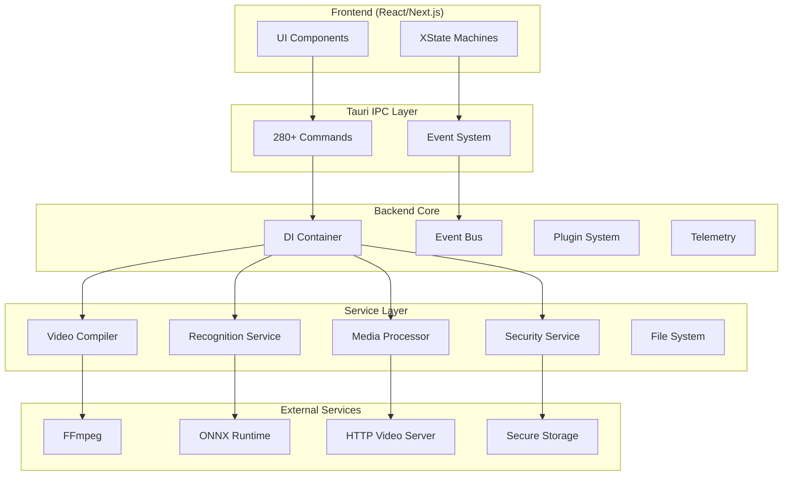
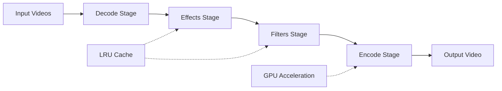

# Timeline Studio Backend Architecture

## 🏗️ Общая архитектура

Timeline Studio Backend построен на принципах модульной, сервис-ориентированной архитектуры с использованием современных паттернов Rust.



## 🎯 Архитектурные принципы

### 1. Dependency Injection (DI)
Все сервисы управляются через централизованный DI контейнер, что обеспечивает:
- Loose coupling между модулями
- Легкость тестирования через моки
- Управление жизненным циклом сервисов

```rust
// Пример регистрации сервиса
let container = ServiceContainer::new();
container.register_singleton::<VideoCompilerService>();
container.register_scoped::<MediaProcessorService>();
```

### 2. Event-Driven Architecture
Event Bus используется для асинхронной коммуникации:
- Декаплинг между модулями
- Реактивные обновления UI
- Аудит и логирование событий

```rust
// Публикация события
event_bus.publish(VideoCompiledEvent { 
    project_id, 
    output_path 
}).await;

// Подписка на события
event_bus.subscribe::<VideoCompiledEvent>(|event| {
    // Обработка события
}).await;
```

### 3. Pipeline Architecture
Video Compiler использует pipeline для обработки:



### 4. Plugin System
WASM-based система плагинов с песочницей:

```rust
// Загрузка плагина
let plugin = PluginManager::load("blur-effect.wasm")?;

// Выполнение в песочнице
let result = plugin.execute_sandboxed(input_frame)?;
```

## 🔧 Основные компоненты

### Core Module
- **DI Container**: Управление зависимостями
- **Event Bus**: Асинхронная коммуникация
- **Plugin Manager**: Загрузка и выполнение плагинов
- **Telemetry**: Метрики и трейсинг
- **Performance**: Кэширование и оптимизации

### Video Compiler
- **Pipeline Engine**: Многоэтапная обработка
- **GPU Manager**: Управление GPU ускорением
- **Cache Service**: LRU кэш для промежуточных результатов
- **FFmpeg Builder**: Генерация команд FFmpeg
- **Recovery Service**: Восстановление битых ссылок

### Security Module
- **Secure Storage**: Шифрование AES-GCM
- **API Validator**: Проверка API ключей
- **OAuth Handler**: OAuth 2.0 авторизация
- **Keychain Integration**: Системные хранилища

### Media Processor
- **Metadata Extractor**: FFprobe интеграция
- **Preview Generator**: Генерация превью
- **Thumbnail Service**: Создание миниатюр
- **Parallel Processor**: Батч обработка

## 🚀 Производительность

### Оптимизации
1. **Zero-copy операции** для больших файлов
2. **Memory pooling** для частых аллокаций
3. **Worker pools** для параллельной обработки
4. **LRU/LFU кэширование** для горячих данных
5. **GPU ускорение** для кодирования

### Метрики производительности
- Время компиляции видео: ~2x реального времени (с GPU)
- Генерация превью: <100ms на кадр
- Извлечение метаданных: <50ms на файл
- Пропускная способность HTTP сервера: 10Gbps+

## 🔐 Безопасность

### Защита данных
- Шифрование API ключей в покое (AES-256-GCM)
- Интеграция с OS keychains
- Безопасная передача через Tauri IPC
- Валидация всех входных данных

### Изоляция плагинов
- WASM sandbox для выполнения
- Ограничения памяти и CPU
- Контроль доступа к API
- Аудит всех операций

## 📊 Мониторинг

### OpenTelemetry интеграция
- Метрики производительности
- Distributed tracing
- Custom dashboards
- Алерты и уведомления

### Health Checks
- Проверка доступности FFmpeg
- Статус GPU кодировщиков
- Память и CPU использование
- Состояние кэша

## 🧪 Тестирование

### Стратегия тестирования
1. **Unit тесты**: 100% покрытие core модуля
2. **Integration тесты**: Взаимодействие модулей
3. **E2E тесты**: Полные сценарии использования
4. **Performance тесты**: Бенчмарки критических путей

### Тестовая инфраструктура
- Mock сервисы для изоляции
- Test fixtures для медиафайлов
- Параллельное выполнение тестов
- CI/CD интеграция

## 📦 Deployment

### Сборка
```bash
# Development
cargo build

# Release с оптимизациями
cargo build --release

# Universal macOS binary
cargo tauri build --target universal-apple-darwin
```

### Платформы
- **macOS**: Universal binary (x64 + ARM64)
- **Windows**: x64 с MSVC
- **Linux**: x64 с поддержкой различных дистрибутивов

## 🔄 Будущие улучшения

### Краткосрочные (Q1 2025)
- [ ] Обновление до Tauri 2.6.2
- [ ] Улучшение error recovery
- [ ] Расширение метрик
- [ ] Оптимизация кэша

### Долгосрочные (2025)
- [ ] WebAssembly рендеринг
- [ ] Распределенная обработка
- [ ] ML-based оптимизации
- [ ] Real-time collaboration

## 📚 Дополнительная документация

- [Development Guide](./DEVELOPMENT.md) - Руководство разработчика
- [API Reference](./API.md) - Справочник команд
- [Plugin Development](./PLUGINS.md) - Создание плагинов
- [Performance Tuning](./PERFORMANCE.md) - Оптимизация производительности