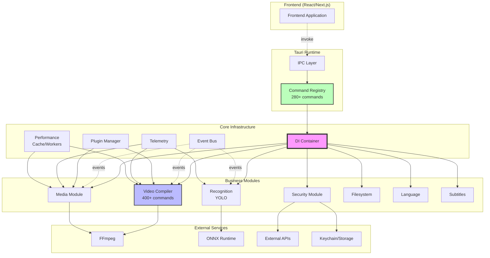

# Диаграмма архитектуры Backend

## Взаимодействие модулей



## Поток данных

### 1. Обработка команд
```
Frontend → Tauri IPC → Command Registry → DI Container → Module → Service
```

### 2. Обработка событий
```
Service → Event Bus → Subscribers → Frontend (через Tauri events)
```

### 3. Обработка медиа
```
Media Module → FFmpeg → Processing → Cache → Result → Frontend
```

### 4. Рендеринг видео
```
Video Compiler → Pipeline Stages → FFmpeg Builder → FFmpeg Executor → Progress Events
```

## Ключевые компоненты

### Core Infrastructure
- **DI Container**: Управление зависимостями и жизненным циклом сервисов
- **Event Bus**: Асинхронное взаимодействие между компонентами
- **Plugin Manager**: WASM-based система плагинов с sandbox изоляцией
- **Telemetry**: OpenTelemetry метрики, трейсинг и health checks
- **Performance**: Кэширование (LRU/LFU/FIFO), worker pools, zero-copy

### Video Compiler
- **Pipeline Architecture**: Поэтапная обработка видео
- **GPU Acceleration**: NVENC, QuickSync, VideoToolbox, AMF
- **Cache System**: LRU кэш для превью и метаданных
- **FFmpeg Integration**: Builder pattern для построения команд

### Security Module
- **Secure Storage**: AES-GCM шифрование для API ключей
- **System Integration**: Keychain (macOS), Credential Manager (Windows)
- **OAuth Support**: YouTube, Instagram, TikTok
- **API Validation**: Проверка ключей OpenAI, Anthropic, Google

### Media Module
- **Parallel Processing**: До 4 файлов одновременно
- **Metadata Cache**: Кэширование с TTL
- **Preview Generation**: Асинхронная генерация миниатюр
- **Format Support**: MP4, MOV, AVI, MKV, MP3, WAV, JPG, PNG и др.

### Recognition Module
- **YOLO Integration**: ONNX Runtime для выполнения моделей
- **Batch Processing**: Обработка видео пакетами
- **Result Aggregation**: Агрегация результатов по времени и классам

## Принципы проектирования

1. **Модульность**: Каждый модуль самодостаточен
2. **Асинхронность**: Все I/O операции неблокирующие
3. **Безопасность**: Type-safe код без unsafe блоков
4. **Производительность**: Кэширование, GPU ускорение, параллелизм
5. **Наблюдаемость**: Метрики, логи, трейсинг, health checks

## Масштабирование

### Горизонтальное
- Worker pools для параллельной обработки
- Независимые сервисы через DI
- Event-driven архитектура

### Вертикальное
- GPU ускорение для видео
- Zero-copy операции
- Memory pooling для частых аллокаций

## Точки расширения

1. **Новые модули**: Регистрация через DI контейнер
2. **Новые команды**: Добавление в app_builder.rs
3. **Новые плагины**: WASM плагины через Plugin Manager
4. **Новые форматы**: Расширение через FFmpeg
5. **Новые сервисы**: Интеграция через Service Container