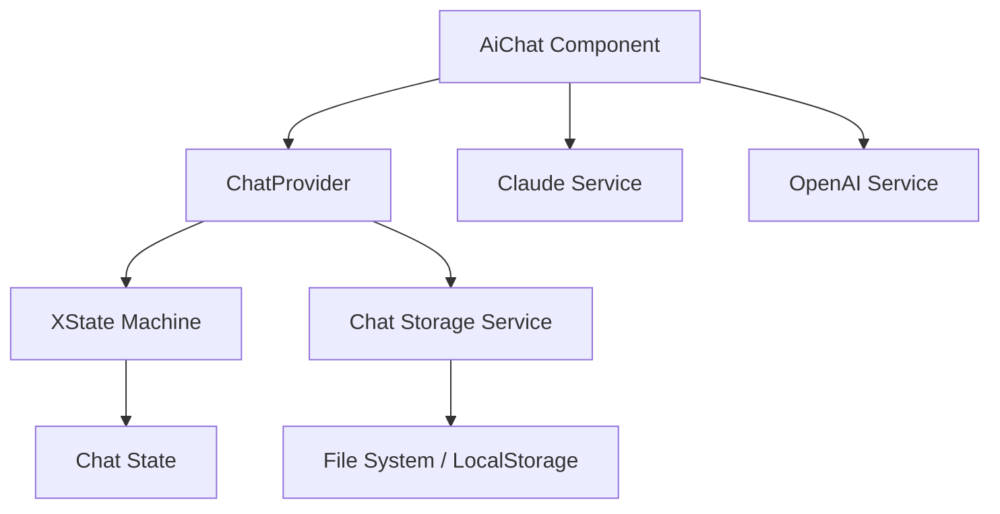

# AI Chat - Руководство разработчика

## Архитектура

### Обзор компонентов



### Основные компоненты

#### 1. **ChatMachine (XState)**
Управляет состоянием чата через конечный автомат.

```typescript
// Состояния
- idle: Ожидание ввода
- processing: Обработка сообщения
- error: Обработка ошибки

// События
- SEND_MESSAGE: Отправка сообщения
- RECEIVE_RESPONSE: Получение ответа
- REMOVE_MESSAGE: Удаление сообщения
- CLEAR_MESSAGES: Очистка истории
- SET_AGENT: Смена модели ИИ
```

#### 2. **ChatStorageService**
Отвечает за сохранение и загрузку чатов.

```typescript
// Основные методы
- createSession(): Создать новый чат
- getSession(): Получить чат по ID
- getAllSessions(): Список всех чатов
- addMessage(): Добавить сообщение
- searchSessions(): Поиск по чатам
```

#### 3. **AI Services**
Интеграция с API провайдерами ИИ.

```typescript
// ClaudeService
- sendMessage(): Отправка в Claude API
- streamResponse(): Потоковый ответ

// OpenAiService  
- sendMessage(): Отправка в OpenAI API
- streamResponse(): Потоковый ответ
```

## Поток данных

### 1. Отправка сообщения
```
User Input → ChatMachine → AI Service → API Request → Response → ChatMachine → UI Update → Storage
```

### 2. Загрузка чатов
```
App Start → ChatProvider → StorageService → Load Sessions → Update State → UI Render
```

### 3. Переключение чатов
```
Select Chat → Load Session → Update Context → Render Messages → Update UI State
```

## Расширение функционала

### Добавление новой модели ИИ

1. **Добавить тип в Agent**
```typescript
// types/chat.ts
export type Agent = 'claude-4-opus' | 'claude-4-sonnet' | 'gpt-4' | 'gpt-4o' | 'gpt-3.5-turbo' | 'o3' | 'your-new-model';
```

2. **Создать сервис**
```typescript
// components/your-ai-service.ts
export class YourAiService implements AIService {
  async sendMessage(message: string, context?: TimelineContext): Promise<string> {
    // Реализация API вызова
  }
}
```

3. **Зарегистрировать в компоненте**
```typescript
// components/ai-chat.tsx
const services = {
  'your-new-model': new YourAiService(),
  // ...
};
```

### Добавление команд Timeline

1. **Определить типы команд**
```typescript
// types/commands.ts
export interface TimelineCommand {
  type: 'add_clip' | 'apply_effect' | 'split_clip' | ...;
  parameters: Record<string, any>;
}
```

2. **Создать парсер команд**
```typescript
// utils/command-parser.ts
export function parseAiResponse(response: string): TimelineCommand[] {
  // Логика парсинга ответа ИИ
}
```

3. **Создать исполнитель команд**
```typescript
// utils/command-executor.ts
export async function executeCommand(
  command: TimelineCommand,
  timelineContext: TimelineContext
): Promise<void> {
  // Логика выполнения команды
}
```

## Интеграция с Timeline

### Получение контекста

```typescript
// hooks/use-timeline-context.ts
export function useTimelineContext(): TimelineContext {
  const timeline = useTimeline();
  const selectedClips = useSelectedClips();
  
  return {
    projectName: timeline.projectName,
    projectDuration: timeline.duration,
    selectedClips: selectedClips.map(clip => ({
      id: clip.id,
      name: clip.name,
      startTime: clip.startTime,
      duration: clip.duration
    })),
    // ...
  };
}
```

### Отправка контекста в ИИ

```typescript
// В chat-machine.ts
SEND_MESSAGE: {
  actions: assign({
    isProcessing: true
  }),
  effects: ['sendMessageToAI']
}

// В эффекте
const context = getTimelineContext();
const enrichedPrompt = buildPromptWithContext(message, context);
```

## Оптимизация производительности

### 1. Ленивая загрузка сообщений
```typescript
// Загружать только последние N сообщений
const MESSAGES_PER_PAGE = 50;

async function loadMessages(sessionId: string, page: number) {
  const session = await getSession(sessionId);
  const start = Math.max(0, session.messages.length - (page * MESSAGES_PER_PAGE));
  const end = session.messages.length - ((page - 1) * MESSAGES_PER_PAGE);
  return session.messages.slice(start, end);
}
```

### 2. Виртуальная прокрутка
```typescript
// Использовать react-window для больших списков
import { VariableSizeList } from 'react-window';

<VariableSizeList
  height={600}
  itemCount={messages.length}
  itemSize={getMessageHeight}
  width="100%"
>
  {MessageRow}
</VariableSizeList>
```

### 3. Дебаунс поиска
```typescript
// Использовать дебаунс для поиска
const debouncedSearch = useMemo(
  () => debounce((query: string) => {
    searchSessions(query);
  }, 300),
  []
);
```

## Безопасность

### 1. Хранение API ключей
```typescript
// Использовать Tauri Store для безопасного хранения
import { Store } from '@tauri-apps/plugin-store';

const secureStore = new Store('.secure');
await secureStore.set('claude_api_key', encryptedKey);
await secureStore.save();
```

### 2. Санитизация ввода
```typescript
// Очищать пользовательский ввод
function sanitizeUserInput(input: string): string {
  return input
    .replace(/<script\b[^<]*(?:(?!<\/script>)<[^<]*)*<\/script>/gi, '')
    .replace(/[<>]/g, '');
}
```

### 3. Rate Limiting
```typescript
// Ограничивать количество запросов
const rateLimiter = new RateLimiter({
  tokensPerInterval: 10,
  interval: 'minute'
});

if (!rateLimiter.tryRemoveTokens(1)) {
  throw new Error('Rate limit exceeded');
}
```

## Тестирование

### 1. Модульные тесты

#### Тесты хранилища
```typescript
// ChatStorageService - полное покрытие
describe('LocalChatStorageService', () => {
  it('должен создавать новую сессию', async () => {
    const session = await service.createSession();
    expect(session.id).toBeDefined();
    expect(session.messages).toEqual([]);
  });
  
  it('должен сохранять и загружать сессии', async () => {
    const created = await service.createSession('Тест');
    const loaded = await service.getSession(created.id);
    expect(loaded?.title).toBe('Тест');
  });
});
```

#### Тесты AI сервисов
```typescript
// Claude и OpenAI сервисы
describe('ClaudeService', () => {
  it('должен отправлять запрос к API', async () => {
    const mockResponse = {
      ok: true,
      json: async () => ({
        content: [{ text: 'Ответ' }],
      }),
    };
    vi.mocked(fetch).mockResolvedValueOnce(mockResponse);
    
    const result = await service.sendMessage('Привет');
    expect(result).toBe('Ответ');
  });
});
```

### 2. Интеграционные тесты

#### Тесты хуков
```typescript
// Тестирование хуков с контекстом
describe('useChat', () => {
  it('должен возвращать контекст чата', () => {
    const { result } = renderHook(() => useChat(), {
      wrapper: ChatProvider,
    });
    
    expect(result.current.chatMessages).toBeDefined();
    expect(result.current.sendChatMessage).toBeFunction();
  });
});
```

#### Тесты компонентов
```typescript
// UI компоненты
describe('AiChat', () => {
  it('должен отображать сообщения', () => {
    render(
      <ChatProvider>
        <AiChat />
      </ChatProvider>
    );
    
    expect(screen.getByText('Привет!')).toBeInTheDocument();
  });
});
```

### 3. E2E тесты
```typescript
// Полный пользовательский сценарий
test('полный поток чата', async ({ page }) => {
  await page.goto('/');
  await page.click('[data-testid="ai-chat-toggle"]');
  
  // Отправка сообщения
  await page.fill('textarea', 'Как добавить эффект?');
  await page.click('[data-testid="send-button"]');
  
  // Ожидание ответа
  await expect(page.locator('.assistant-message')).toBeVisible();
});
```

### Мокирование

#### Мок API сервисов
```typescript
// Mock ClaudeService
vi.mock('../../components/claude-service', () => ({
  ClaudeService: vi.fn().mockImplementation(() => ({
    sendMessage: vi.fn().mockResolvedValue('Мок ответ'),
  })),
}));
```

#### Мок хранилища
```typescript
// Mock Tauri APIs
vi.mock('@tauri-apps/plugin-fs', () => ({
  exists: vi.fn(),
  mkdir: vi.fn(),
  readTextFile: vi.fn(),
  writeTextFile: vi.fn(),
}));
```

### Покрытие тестами

```bash
# Проверить покрытие
bun run test:coverage src/features/ai-chat

# Отчет о покрытии
open coverage/index.html
```

#### Текущее состояние покрытия
```
Статистика тестов (обновлено):
- Файлов тестов: 10
- Всего тестов: 143
- Прошедших: 133 ✅
- Пропущенных: 10 (сложные интеграционные тесты)

Покрытие кода:
┌─────────────────┬─────────┬──────────┬─────────┬─────────┐
│ Компонент       │ Stmts   │ Branch   │ Funcs   │ Lines   │
├─────────────────┼─────────┼──────────┼─────────┼─────────┤
│ components/     │ 78.04%  │ 87.34%   │ 88.88%  │ 78.04%  │
│ services/       │ 84.06%  │ 78.94%   │ 83.33%  │ 84.06%  │
│ hooks/          │ 80.95%  │ 100%     │ 75%     │ 80.95%  │
│ types/          │ 100%    │ 100%     │ 100%    │ 100%    │
└─────────────────┴─────────┴──────────┴─────────┴─────────┘

Наивысшее покрытие:
- chat-machine.ts: 100% всех метрик ✅
- claude-service.ts: 58.67% (тестирование API интеграции)
- open-ai-service.ts: 68.8% (тестирование API интеграции)
- chat-storage-service.ts: 77.82% (файловая система)
```

Цель: 90%+ покрытие для всех файлов.

## Отладка

### 1. Логирование состояний XState
```typescript
// Включить инспектор XState
import { inspect } from '@xstate/inspect';

if (process.env.NODE_ENV === 'development') {
  inspect({
    iframe: false
  });
}
```

### 2. Логирование API запросов
```typescript
// Логировать все API вызовы
const apiLogger = (config: AxiosRequestConfig) => {
  console.log('API Request:', {
    url: config.url,
    method: config.method,
    data: config.data
  });
  return config;
};

axios.interceptors.request.use(apiLogger);
```

### 3. Redux DevTools для XState
```typescript
// Подключить Redux DevTools
const service = interpret(machine, {
  devTools: true
});
```

## Часто встречающиеся проблемы

### 1. Сообщения не сохраняются
- Проверить инициализацию StorageService
- Убедиться, что директория Chats создана
- Проверить права доступа к файловой системе

### 2. API не отвечает
- Проверить наличие API ключа
- Проверить лимиты rate limiting
- Проверить CORS настройки

### 3. Состояние не обновляется
- Проверить подписку на изменения машины
- Убедиться в правильности событий
- Проверить контекст провайдера

## Дальнейшее развитие

### Краткосрочные цели (1-2 недели)
1. Завершить интеграцию API
2. Реализовать UI списка чатов
3. Добавить автосохранение

### Среднесрочные цели (1-2 месяца)
1. Потоковые ответы
2. Контекст Timeline
3. Выполнение команд

### Долгосрочные цели (3-6 месяцев)
1. Голосовой ввод
2. Многоязычность
3. Обучение на проектах пользователя