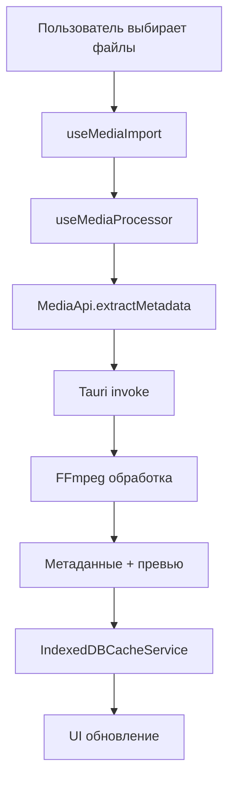
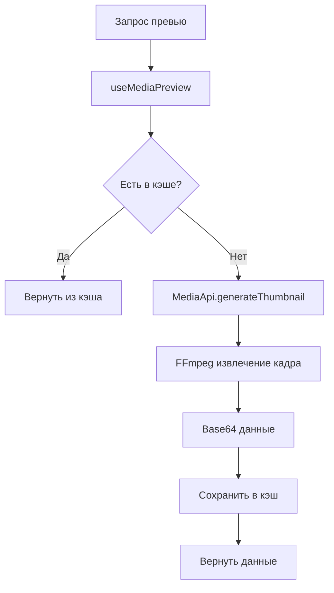

# Модуль Media - Руководство разработчика

## Обзор архитектуры

Модуль media отвечает за все операции с медиафайлами в Timeline Studio. Построен на основе React хуков, XState машин состояний и Tauri для взаимодействия с нативными API.

## Структура каталогов

```
media/
├── components/        # React компоненты
├── hooks/             # Кастомные React хуки
├── services/          # Бизнес-логика и сервисы
├── types/             # TypeScript типы
├── utils/             # Вспомогательные функции
└── __tests__/         # Тесты
```

## Основные компоненты

### Хуки (Hooks)

#### `useMediaProcessor`
Основной хук для обработки медиафайлов. Интегрируется с Tauri backend для извлечения метаданных через FFmpeg.

```typescript
const { 
  scanFolder,
  scanFolderWithThumbnails,
  processFiles,
  isProcessing,
  progress,
  errors 
} = useMediaProcessor({
  onFilesDiscovered: (files) => {},
  onMetadataReady: (fileId, metadata) => {},
  onThumbnailReady: (fileId, thumbnailPath) => {},
  onError: (fileId, error) => {},
  onProgress: (current, total) => {}
})
```

**События процессора:**
- `FilesDiscovered` - обнаружены файлы
- `MetadataReady` - метаданные извлечены
- `ThumbnailReady` - миниатюра готова
- `ProcessingError` - ошибка обработки
- `ScanProgress` - прогресс сканирования

#### `useMediaPreview`
Управляет генерацией превью и кэшированием данных предпросмотра.

```typescript
const {
  getPreviewData,
  generateThumbnail,
  clearPreviewData,
  getFilesWithPreviews,
  savePreviewData,
  loadPreviewData,
  isGenerating,
  error
} = useMediaPreview({
  onThumbnailGenerated: (fileId, thumbnail) => {},
  onError: (error) => {}
})
```

#### `useFramePreview`
Извлекает кадры из видео для скраббинга по таймлайну.

```typescript
const {
  extractTimelineFrames,
  extractRecognitionFrames,
  getFrameAtTimestamp,
  isExtracting,
  error
} = useFramePreview({
  onFramesExtracted: (frames) => {},
  onError: (error) => {}
})
```

**Особенности:**
- Кэширование в IndexedDB
- Поддержка извлечения для распознавания
- Оптимизация интервалов кадров

#### `useMediaImport`
Управляет импортом файлов и папок.

```typescript
const {
  importFiles,
  importFolder,
  clearImport,
  progress,
  isImporting,
  error,
  importedFiles
} = useMediaImport()
```

#### `useVideoStreaming`
Интеграция с локальным видео-сервером для стриминга.

```typescript
const {
  videoUrl,
  isLoading,
  error,
  retry
} = useVideoStreaming(filePath)

const { 
  isServerRunning, 
  checkServerStatus 
} = useVideoServerStatus()
```

#### `useCacheStatistics`
Мониторинг использования кэша IndexedDB.

```typescript
const {
  statistics,
  isLoading,
  error,
  refreshStatistics,
  clearAllCaches,
  clearFrameCache,
  clearMetadataCache
} = useCacheStatistics()
```

#### `useMediaRestoration`
Восстановление отсутствующих медиафайлов.

```typescript
const {
  restoreProjectMedia,
  resolveMissingFiles,
  cancelResolution,
  isRestoring,
  missingFiles,
  restorationProgress,
  error
} = useMediaRestoration()
```

### Сервисы (Services)

#### `MediaApi`
Низкоуровневое API для операций с медиа.

```typescript
class MediaApi {
  static async extractMetadata(filePath: string): Promise<MediaMetadata>
  static async generateThumbnail(params: ThumbnailParams): Promise<string>
  static async generateThumbnails(files: MediaFile[]): Promise<void>
  static async validateMediaFile(filePath: string): Promise<boolean>
  static async getMediaDuration(filePath: string): Promise<number>
}
```

#### `VideoStreamingService`
Управление локальным видео-сервером.

```typescript
class VideoStreamingService {
  async startServer(): Promise<void>
  async stopServer(): Promise<void>
  async getVideoUrl(filePath: string): Promise<string>
  async isServerRunning(): Promise<boolean>
}
```

#### `IndexedDBCacheService`
Кэширование данных в браузере.

```typescript
class IndexedDBCacheService {
  async cacheFrames(key: string, frames: Frame[]): Promise<void>
  async getCachedFrames(key: string): Promise<Frame[] | null>
  async cacheMetadata(key: string, metadata: Metadata): Promise<void>
  async getCachedMetadata(key: string): Promise<Metadata | null>
  async getCacheStatistics(): Promise<CacheStatistics>
  async clearAllCaches(): Promise<void>
}
```

#### `MediaRestorationService`
Восстановление отсутствующих файлов.

```typescript
class MediaRestorationService {
  async restoreProjectMedia(projectId: string): Promise<RestorationResult>
  async findMissingFiles(mediaFiles: MediaFile[]): Promise<MissingFile[]>
  async resolveFilePath(oldPath: string, newPath: string): Promise<void>
  async generateRestorationReport(result: RestorationResult): string
}
```

## Поток данных

### Импорт медиафайлов



### Генерация превью



## Интеграция с Tauri

### Команды (Commands)

```rust
// Backend команды, вызываемые через invoke
#[tauri::command]
async fn extract_media_metadata(file_path: String) -> Result<MediaMetadata>

#[tauri::command]
async fn generate_media_thumbnail(params: ThumbnailParams) -> Result<String>

#[tauri::command]
async fn scan_media_folder(folder_path: String) -> Result<Vec<MediaFile>>

#[tauri::command]
async fn process_media_files(file_paths: Vec<String>) -> Result<Vec<MediaFile>>
```

### События (Events)

```typescript
// События, отправляемые из backend
listen<ProcessorEvent>('media-processor', (event) => {
  switch (event.payload.type) {
    case 'FilesDiscovered':
    case 'MetadataReady':
    case 'ThumbnailReady':
    case 'ProcessingError':
    case 'ScanProgress':
  }
})
```

## Оптимизация производительности

### Кэширование

1. **IndexedDB кэширование**
   - Кадры видео для скраббинга
   - Метаданные файлов
   - Данные превью

2. **In-memory кэширование**
   - URL стриминга
   - Статистика кэша

### Батч-обработка

```typescript
// Обработка файлов пакетами
const BATCH_SIZE = 10
for (let i = 0; i < files.length; i += BATCH_SIZE) {
  const batch = files.slice(i, i + BATCH_SIZE)
  await processFiles(batch)
}
```

### Дебаунсинг и троттлинг

```typescript
// Дебаунс для поиска
const debouncedSearch = useMemo(
  () => debounce(handleSearch, 300),
  []
)

// Троттлинг для обновления прогресса
const throttledProgress = useMemo(
  () => throttle(updateProgress, 100),
  []
)
```

## Обработка ошибок

### Паттерны обработки ошибок

```typescript
// В хуках
try {
  const result = await someOperation()
  return result
} catch (err) {
  const errorMsg = err instanceof Error ? err.message : 'Unknown error'
  setError(errorMsg)
  options.onError?.(errorMsg)
  return null
}

// В сервисах
async function operation() {
  try {
    return await riskyOperation()
  } catch (error) {
    console.error('Operation failed:', error)
    // Восстановление или fallback
    return fallbackValue
  }
}
```

### Типы ошибок

- `FileNotFoundError` - файл не найден
- `MetadataExtractionError` - ошибка извлечения метаданных
- `ThumbnailGenerationError` - ошибка генерации превью
- `CacheError` - ошибка кэширования
- `StreamingError` - ошибка стриминга

## Тестирование

### Моки для тестов

```typescript
// Мок Tauri API
vi.mock('@tauri-apps/api/core', () => ({
  invoke: vi.fn()
}))

// Мок IndexedDB
vi.mock('idb-keyval', () => ({
  get: vi.fn(),
  set: vi.fn(),
  del: vi.fn(),
  entries: vi.fn()
}))
```

### Паттерны тестирования хуков

```typescript
import { renderHook, act, waitFor } from '@testing-library/react'

it('should handle async operations', async () => {
  const { result } = renderHook(() => useMediaProcessor())
  
  await act(async () => {
    await result.current.scanFolder('/path/to/folder')
  })
  
  await waitFor(() => {
    expect(result.current.isProcessing).toBe(false)
  })
})
```

## Расширение функциональности

### Добавление нового хука

1. Создать файл в `hooks/use-[name].ts`
2. Экспортировать из `hooks/index.ts`
3. Создать тесты в `__tests__/hooks/use-[name].test.ts`
4. Документировать в DEV.md

### Добавление нового сервиса

1. Создать класс в `services/[name]-service.ts`
2. Добавить singleton паттерн
3. Интегрировать с Tauri если нужно
4. Создать тесты
5. Документировать API

### Интеграция с backend

1. Добавить Rust команду в Tauri
2. Создать TypeScript типы
3. Вызвать через `invoke`
4. Обработать ошибки
5. Добавить тесты

## Известные проблемы и ограничения

1. **Размер кэша IndexedDB** - браузеры имеют лимиты на хранилище
2. **Производительность при большом количестве файлов** - нужна пагинация
3. **Поддержка форматов** - зависит от FFmpeg
4. **Стриминг больших файлов** - может потребовать оптимизации

## Полезные ссылки

- [Tauri API](https://tauri.app/v1/api/js/)
- [FFmpeg документация](https://ffmpeg.org/documentation.html)
- [IndexedDB API](https://developer.mozilla.org/en-US/docs/Web/API/IndexedDB_API)
- [XState документация](https://xstate.js.org/docs/)